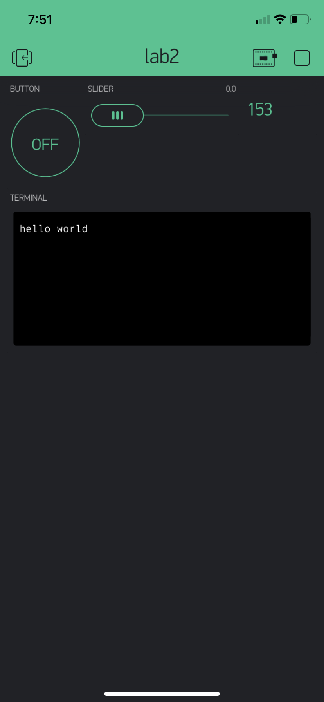

Name: Amanda Vuong

EID: axv72

Team Number:

## Questions

1. What is the purpose of an IP address?

    For other devices to identify

2. What is a DNS? What are the benefits of using domain names instead of IP addresses?

    Domain name servers. Easier to read than IP address

3. What is the difference between a static IP and a dynamic IP?

    Static: address doesn't change. Dynamic: assigned by the network when they connect and change over time

4. What is the tradeoff between UDP and TCP protocols?

    You never miss any data with TCP, however you incur latency. With UCP, if a packet is lost, it is forgotten, however you never incur latency. 

5. Why can't we use the delay function with Blynk?

    It would get in the way of the other routines

6. What does it mean for a function to be "Blocking"?

    Computes forever

7. Why are interrupts useful for writing Non-Blocking code?

    Don't require continous checks

8. What is the difference between interface and implementation? Why is it important?
   The interface is an empty shell, methods do not have a body. The implentation is the actual substance behind the idea, the actual definition of how the interface will do what we expect it to.

9. Screenshot of your Blynk App:

    
